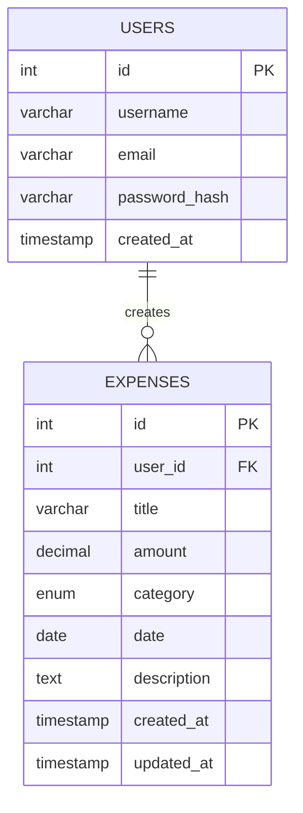

# Database Design and Implementation

## 1. Entity-Relationship (ER) Diagram



## 2. Normalization

The database schema has been normalized up to the **Third Normal Form (3NF)** to minimize redundancy and avoid insertion, update, and deletion anomalies.

### First Normal Form (1NF)
- **Rule**: All columns must contain atomic (indivisible) values, and each record needs to be unique.
- **Application**: Both `users` and `expenses` tables have atomic columns. For instance, the `category` column in `expenses` handles exactly one selected item format, and each record has a unique `id` serving as the Primary Key. There are no repeating groups.

### Second Normal Form (2NF)
- **Rule**: It must be in 1NF, and all non-key attributes must be fully functionally dependent on the entire primary key (applies to composite keys).
- **Application**: Since our tables use single-column primary keys (`id` for both `users` and `expenses`), and all other attributes in each table depend directly and entirely on those `id` fields respectively, the schema automatically satisfies 2NF.

### Third Normal Form (3NF)
- **Rule**: It must be in 2NF, and there must be no transitive dependencies (non-key attributes should not depend on other non-key attributes).
- **Application**: In the `users` table, `username`, `email`, and `password_hash` depend solely on the user `id`. In the `expenses` table, all columns (`title`, `amount`, `category`, `date`, `description`) describe the specific expense entity and depend directly on the expense `id`. There are no transitive dependencies; hence, the database is in 3NF.

---

## 3. Database Design Details

### Data Dictionary

#### Table: `users`
| Column Name | Data Type | Constraints | Description |
| :--- | :--- | :--- | :--- |
| `id` | INT | PRIMARY KEY, AUTO_INCREMENT | Unique identifier for the user. |
| `username` | VARCHAR(255) | UNIQUE, NOT NULL | The user's chosen username. |
| `email` | VARCHAR(255) | UNIQUE, NOT NULL | The user's registered email address. |
| `password_hash` | VARCHAR(255) | NOT NULL | Securely hashed password for authentication. |
| `created_at` | TIMESTAMP | DEFAULT CURRENT_TIMESTAMP | Timestamp indicating when the user registered. |

#### Table: `expenses`
| Column Name | Data Type | Constraints | Description |
| :--- | :--- | :--- | :--- |
| `id` | INT | PRIMARY KEY, AUTO_INCREMENT | Unique identifier for the expense entry. |
| `user_id` | INT | NOT NULL, FOREIGN KEY | Links the expense to the user who created it (REFERENCES `users(id)`). |
| `title` | VARCHAR(255) | NOT NULL | Brief title or name of the expense. |
| `amount` | DECIMAL(10, 2) | NOT NULL | Money amount spent (allows up to 2 decimal places). |
| `category` | ENUM | NOT NULL | Category of expense ('Food', 'Travel', 'Shopping', etc.). |
| `date` | DATE | NOT NULL | The specific date the expense occurred. |
| `description` | TEXT | NULL | Optional detailed description of the expense. |
| `created_at` | TIMESTAMP | DEFAULT CURRENT_TIMESTAMP | Creation timestamp of the record. |
| `updated_at` | TIMESTAMP | ON UPDATE CURRENT_TIMESTAMP | Timestamp automatically updated on row modification. |

---

## 4. Implementation

The following is the structured DDL (Data Definition Language) Implementation for generating the database tables.

### SQL Implementation Script (`schema.sql`)
```sql
-- Create USERS table
CREATE TABLE IF NOT EXISTS users (
  id INT AUTO_INCREMENT PRIMARY KEY,
  username VARCHAR(255) UNIQUE NOT NULL,
  email VARCHAR(255) UNIQUE NOT NULL,
  password_hash VARCHAR(255) NOT NULL,
  created_at TIMESTAMP DEFAULT CURRENT_TIMESTAMP
);

-- Create EXPENSES table
CREATE TABLE IF NOT EXISTS expenses (
  id INT AUTO_INCREMENT PRIMARY KEY,
  user_id INT NOT NULL,
  title VARCHAR(255) NOT NULL,
  amount DECIMAL(10, 2) NOT NULL,
  category ENUM('Food', 'Travel', 'Shopping', 'Entertainment', 'Health', 'Utilities', 'Education', 'Other') NOT NULL,
  date DATE NOT NULL,
  description TEXT,
  created_at TIMESTAMP DEFAULT CURRENT_TIMESTAMP,
  updated_at TIMESTAMP DEFAULT CURRENT_TIMESTAMP ON UPDATE CURRENT_TIMESTAMP,
  FOREIGN KEY (user_id) REFERENCES users(id) ON DELETE CASCADE
);
```

### Sample DML (Data Manipulation) Operations

#### Insertion Examples
```sql
-- Insert a new user
INSERT INTO users (username, email, password_hash) 
VALUES ('JohnDoe', 'john@example.com', '$2b$10$abcdefghijklmnopqrstuv');

-- Insert a new expense
INSERT INTO expenses (user_id, title, amount, category, date, description) 
VALUES (1, 'Grocery Store', 54.20, 'Food', '2023-11-01', 'Weekly grocery shopping');
```

#### Querying Examples
```sql
-- Retrieve all expenses for a specific user, sorted by date newest first
SELECT * FROM expenses WHERE user_id = 1 ORDER BY date DESC;

-- Get total spent amount per category for a user
SELECT category, SUM(amount) AS total_spent 
FROM expenses 
WHERE user_id = 1 
GROUP BY category;
```
